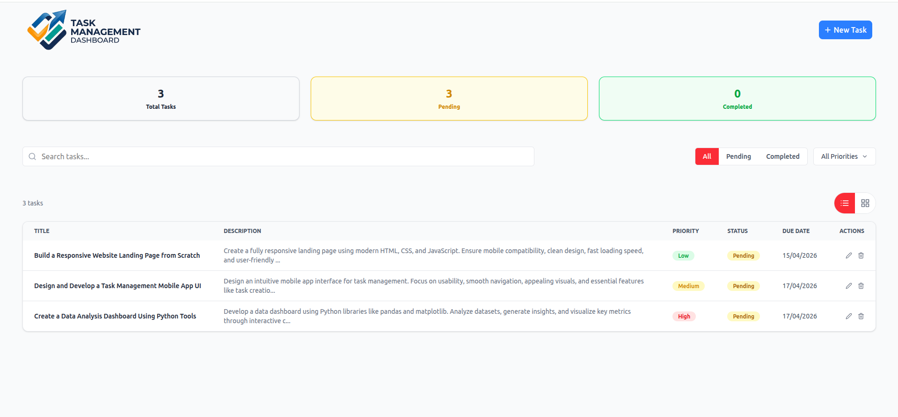
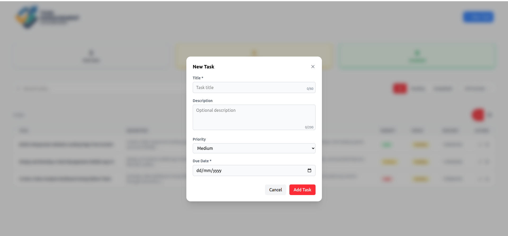
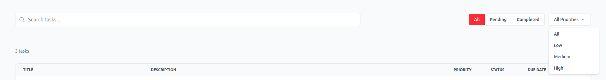
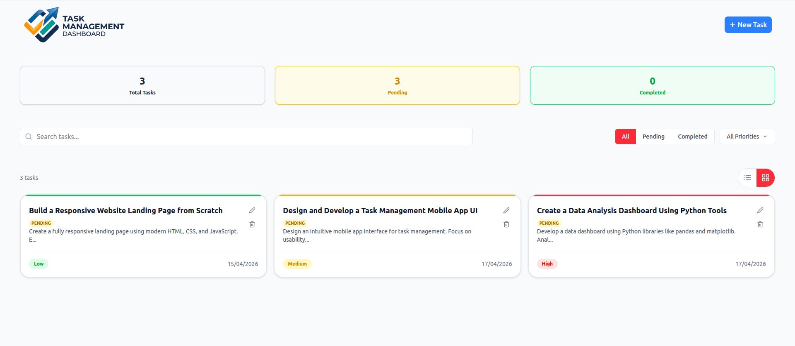

# Task Management Dashboard

A responsive task management dashboard built with React, TypeScript, Vite, and Tailwind CSS.

The app lets you create, edit, delete, search, filter, and reorder tasks in a polished dashboard interface.

## 🌐 Live Demo

**Live Demo:**    https://task-management-dashboard-samarjeet.vercel.app/

---

## 🚀 Features

- Add new tasks with title, description, priority, and due date
- Edit existing tasks, including status updates for completed tasks
- Delete tasks with a confirmation flow
- Search tasks by title or description
- Filter tasks by status (`All`, `Pending`, `Completed`)
- Filter tasks by priority (`All`, `Low`, `Medium`, `High`)
- Toggle between list and grid views
- Drag-and-drop reorder tasks with persistent ordering via `localStorage`
- Task summary cards showing total, pending, and completed counts
- Responsive layout for desktop and mobile

---

## 📁 Project Structure

- `src/App.tsx` — main app state and logic
- `src/Components/Navbar.tsx` — top navigation and add-task button
- `src/Components/NewTaskModal.tsx` — modal form for creating or editing tasks
- `src/Components/SearchAndFilter.tsx` — search input, status tabs, and priority filter dropdown
- `src/Components/TaskInTableView.tsx` — list/grid views, drag-and-drop reorder, actions
- `src/Components/TaskStatus.tsx` — dashboard summary cards

---

## 🛠️ Setup Instructions

1. Install dependencies:

```bash
npm install
```

2. Start the development server:

```bash
npm run dev
```

3. Open the local URL shown in the terminal (usually `http://localhost:5173`).

4. Build the project for production:

```bash
npm run build
```

5. Preview the production build locally:

```bash
npm run preview
```

---

## 🎨 Design Decisions

- **LocalStorage persistence:** Tasks and task order are saved in the browser so data remains after refresh without needing a backend.
- **Modal UI for task entry:** A single modal supports both create and edit flows, keeping the UX consistent.
- **List and grid toggle:** Users can choose a compact table view or a card-based grid view for better readability.
- **Filtering & search:** Combined status tabs, priority dropdown, and search input make task discovery fast.
- **Validation hints:** Title and description character counters and validation help prevent bad input.
- **Tailwind CSS:** Tailwind enables a clean responsive interface with minimal custom CSS.

---

## 📸 Screenshots

### Dashboard Overview



### Task Modal



### Search and Filters



### Card View



---

## 📦 Dependencies

- `react`
- `react-dom`
- `react-icons`
- `tailwindcss`
- `@vitejs/plugin-react`

Dev dependencies include TypeScript, ESLint, Vite, and supporting TypeScript type packages.

---

## ✅ Notes

- Task state is initialized from `localStorage` using the key `task_management_tasks`.
- Drag-and-drop order is persisted using the key `taskOrder`.
- The task modal requires a title and due date before submission.

---

## 📌 Getting Started

Once installed, use the New Task button to add tasks, then use the filter controls to narrow results, or switch views to see tasks in different layouts.

Enjoy managing tasks with this dashboard!
